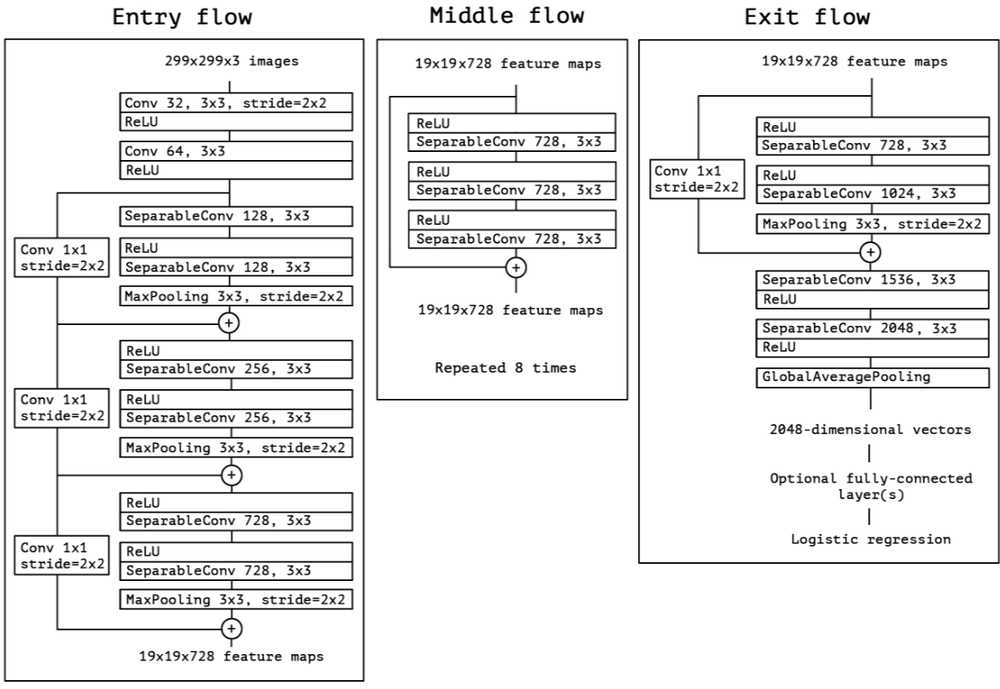
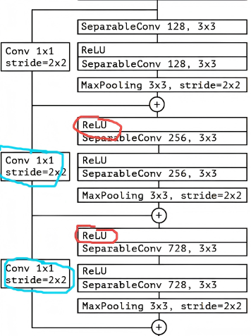

<div style="text-align: center; margin-bottom: 10px;">
    <font face="黑体" size="6">实验六、Xception</font>
</div>
<table width="100%" style="margin-bottom: 4px;">
  <tr>
    <td align="left"><b>卢豪豪</b></td>
    <td align="center"><b>202310310239</b></td>
    <td align="right"><b>指导老师：胡政伟</b></td>
  </tr>
</table>


#### 一、实验目的

PyTorch 复现原论文 [Xception: Deep Learning with Depthwise Separable Convolutions](https://arxiv.org/pdf/1610.02357 ) 。

#### 二、实验内容
##### 1、Inception & Xception
Xcaption 脱胎于 Inception （正如其名，Extreme Inception）。Iception 思想是将卷积拆分为 cross-channel conv & Spatial conv，更精确来说就是先 **1×1 卷积** 将数据映射到几个不同 Channel （< Input Channel），然后再分别用 **3×3、5×5 ** conv ，也就是原Paper Figure 1描述的这样。


考虑将 incption 简化：去掉 AVG，然后只用一种尺寸卷积（e.g. 3x3），就得到了 Figure 2这种结构。


在 Figure 2的基础上，用一个 Channel 很大的 **1x1** Conv 将输入映射到一个大 Channel 输出上。再将这个输出切成“段”，每“段”分别 **3x3** Conv，就得到了原 Paper Figure 3。


然后每个 Channel 切一“片”，对每个 Channel 做 3X3 Conv。同时作者提出了一个Question : 分割的数量 & 大小会产生什么影响？将 cross-channel conv和spatial conv完全解耦分开合理吗？可以这样做吗？

作者在上述假设下，走向了极端：还是先用 1X1 conv ，但是**切段** ➡️ **切片** ，也就是每个 Channel 切一片。然后每个 Channel 做 3x3 Conv。此时这种极端版本其实很像（is almost identical to）depthwise separable convolution 了。


为什么“很像”，而不是就是？

- 操作顺序：depthwise separable convolution，先用 3x3 conv 进行 spatial conv，后用 1x1 conv 进行 cross-channel conv （也就是先空间解耦，再通道混合。）；极端版本 Inception 先用 1x1 conv 再用3x3 conv （反过来了）；（**Ps** ：MobileNet V2 / Inverted Residual ）
- 激活函数差异：depthwise separable convolutions 通常实现时不会使用非线性激活；而 Inception 两个操作都跟随着 ReLU 非线性激活。

操作顺序这里，我将其理解为**先压缩再扩展**（不过其实原 Paper 实际强调的是 先空间解耦，在通道混合），不过在 V2 版本，明确了就是要**先扩展再压缩**，两个原因：

- 信息在“高维空间”中更容易表达，先压缩势必会造成信息损失；
- Linear Bottleneck

特别地，作者认为第一个操作顺序上的区别并不重要，特别是因为这些操作旨在堆叠使用。第二个更加重要！原 Paper 在最后也进行了消融实验来证实这一点（激活函数差异），结果如下：


#### 2、结构描述及复现

##### 2.1 描述 & 思路

关键假设：CNN 特征图中的跨通道相关性 & 空间相关性的映射可以被完全解耦。然后作者解释了为什么 Xception (Extreme Incption) ：因为这一假设是 Inception 假设的 pro max 版本😄。采用这种设定，Xception 结构被解释为原 Paper Figure 5 的样子。



> The Xception architecture: the data first goes through the entry flow, then through the middle flow which is repeated eight times, and finally through the exit flow. Note that all Convolution and SeparableConvolution layers are followed by batch normalization [7] (notincluded in the diagram). All SeparableConvolution layers use a depth multiplier of 1 (no depth expansion).


Xception 的特征提取基础由36个 Conv layer 组成。这36个 Conv layer 被进一步组织成14个module，除了第一个 & 最后一个 module ，其余均带有 residual connection 。可以说 X ception 就是连续使用 depthwise separable convolution layer 和 residual connection 。

实现时，为了方便，以 module 为单位：

- Entry flow：
  -  1th module 普通卷积单独实现；
  - 2~4 module：结构相似（基本都是下采样），用 `_PoolENBlock` 实现。
- Middle flow：5~ 12 module 结构相似，且不下采样，用 `_PoolMBlock` 实现。
- Exit Block ：
  - 14th module 与 2~4th module 类似（Channel 不同），用 `_PoolExBlock` 实现。


##### 2.2 实现

- 首先就是 depthwise seperabel convolution ，调用 `nn.Conv2d()` 分别指定 `groups = in_channels` 、`kernel_size = 1` 就能实现。

```python
class SeparableConv2d(nn.Module):
    def __init__(self, in_channels, out_channels, kernel_size=3, stride=1,
                 padding=1, dilation=1, bias=True):

        super(SeparableConv2d, self).__init__()
        self.dconv = nn.Conv2d(in_channels, in_channels, kernel_size, stride,
                               padding=padding, dilation=dilation,
                               groups=in_channels, bias=bias)
        self.pconv = nn.Conv2d(in_channels, out_channels, kernel_size=1,
                               bias=bias)
        pass

    def forward(self, x):
        return self.pconv(self.dconv(x))  # 先depthwise conv，后pointwise conv
    
    pass
```

- 残差分支（project/skip），就是 1x1 Conv & BatchNorm。

```python
class ResidualConnection(nn.Sequential):
    def __init__(self, in_channels, out_channels, stride=1):
		# 默认不下采样，只调整 Channel
        super(ResidualConnection, self).__init__(
            nn.Conv2d(in_channels, out_channels, 1, stride=stride, bias=False),
            nn.BatchNorm2d(out_channels)
        )
        pass

    pass
```

- `_PoolEnBlock` ，按照论文所说 **all Convolution and SeparableConvolution layers are followed by batch normalization** ，后面跟 BN；对于每个 module中的 SeparableConv 其 output_channels 一样，最后 MaxPool 下采样。还有就是增加了一个参数 relu1 （因为第一个 Module 前没有接 ReLu ）。实现如下：

```python
class _PoolEnBlock(nn.Module):
    def __init__(self, in_channels, out_channels, relu1=True): # 默认有 relu
        super(_PoolEnBlock, self).__init__()
        self.project = ResidualConnection(in_channels, out_channels, stride=2)
        self.relu1 = None
        if relu1:
            self.relu1 = nn.ReLU(inplace=False) # 特别地，这里要为 Fales
            
        self.sepconv1 = SeparableConv2d(in_channels, out_channels,
                                        kernel_size=3, padding=1, bias=False)
        self.bn1 = nn.BatchNorm2d(out_channels)

        self.relu2 = nn.ReLU(inplace=True)
        self.sepconv2 = SeparableConv2d(out_channels, out_channels,
                                        kernel_size=3, padding=1, bias=False)
        self.bn2 = nn.BatchNorm2d(out_channels)

        self.maxpool = nn.MaxPool2d(3, stride=2, padding=1)
        pass

    def forward(self, x):
        identity = self.project(x)  

        if self.relu1:  # 第1个Separable Conv前面没有ReLU，需要判断一下
            x = self.relu1(x)
        x = self.sepconv1(x)  # 1th
        x = self.bn1(x)

        x = self.relu2(x)
        x = self.sepconv2(x)  # 2th
        x = self.bn2(x)

        x = self.maxpool(x)  # 下采样2倍
        x = x + identity  # residual connection
        return x

    pass
```

- Middle flow 的话中间就是重复三个相同的 Block （Channel、Spatial size 都不变），重复即可。实现如下：

```python
class _PoolMBlock(nn.Module):
    def __init__(self, in_channels=728):
        super(_PoolMBlock, self).__init__()
        
        mods = [
            nn.ReLU(inplace=False), 
            SeparableConv2d(in_channels, in_channels, 3, padding=1, bias=False),
            nn.BatchNorm2d(in_channels)
        ]
        mods *= 3  # 重复 3 次
        self.convs = nn.Sequential(*mods)

    def forward(self, x):
        return x + self.convs(x)
```

- Exit flow ，第一个 Module 两个 Seperable Conv 的 Out_Channels 不一样（728 & 1024），然后都是下采样两倍。实现如下：

```python
class _PoolExitBlock(nn.Module):
    def __init__(self, in_channels=728, out_channels=1024):
        super(_PoolExitBlock, self).__init__()
        self.project = ResidualConnection(in_channels, out_channels, stride=2)

        self.relu1 = nn.ReLU(inplace=False)  
        self.sepconv1 = SeparableConv2d(in_channels, in_channels,
                                        kernel_size=3, padding=1, bias=False)
        self.bn1 = nn.BatchNorm2d(in_channels)

        self.relu2 = nn.ReLU(inplace=True)
        self.sepconv2 = SeparableConv2d(in_channels, out_channels,
                                        kernel_size=3, padding=1, bias=False)
        self.bn2 = nn.BatchNorm2d(out_channels)

        self.maxpool = nn.MaxPool2d(3, stride=2, padding=1)
        pass

    def forward(self, x):
        identity = self.project(x) 

        x = self.relu1(x)
        x = self.sepconv1(x)  # 1th
        x = self.bn1(x)

        x = self.relu2(x)
        x = self.sepconv2(x)  # 2th
        x = self.bn2(x)

        x = self.maxpool(x)  # 下采样2倍

        x = x + identity  # plus
        return x

    pass
```

- 最后的话就是主干网络喽，除了上述带 Residual Connection 的 Module ，其实就剩下需要单独实现的卷积操作了，不在详细说明。然后初始化的话原 Paper 并未声明，我默认将其使用 Kaiming Initialization 。实现如下：

```python
class Xception(nn.Module):
    def __init__(self, in_channels=3, num_classes=1000):
        super(Xception, self).__init__()
        #Entry flow
        conv1 = [nn.Conv2d(in_channels, 32, 3, stride=2, padding=1, bias=False),
                 nn.BatchNorm2d(32),
                 nn.ReLU(inplace=True),]
        self.entry_conv1 = nn.Sequential(*conv1)

        conv2 = [nn.Conv2d(32, 64, 3, padding=1, bias=False),
                 nn.BatchNorm2d(64),
                 nn.ReLU(inplace=True),]
        self.entry_conv2 = nn.Sequential(*conv2)

        self.entry_block1 = _PoolEntryBlock(64, 128, relu1=False)
        self.entry_block2 = _PoolEntryBlock(128, 256)
        self.entry_block3 = _PoolEntryBlock(256, 728)

        #Middle flow
        self.middle_flow = nn.ModuleList([_PoolMiddleBlock(728) for _ in range(8)])

        #Exit flow
        self.exit_block = _PoolExitBlock(728, 1024)

        conv1 = [SeparableConv2d(1024, 1536, 3, padding=1, bias=False),
                 nn.BatchNorm2d(1536),
                 nn.ReLU(inplace=True),]
        self.exit_conv1 = nn.Sequential(*conv1)

        conv2 = [SeparableConv2d(1536, 2048, 3, padding=1, bias=False),
                 nn.BatchNorm2d(2048),
                 nn.ReLU(inplace=True),]
        self.exit_conv2 = nn.Sequential(*conv2)

        self.avgpool = nn.AdaptiveAvgPool2d(1)
        self.fc = nn.Linear(2048, num_classes) 


    def _init_weights(self): # Kaiming Initialization
        for m in self.modules():
            if isinstance(m, nn.Conv2d):
                nn.init.kaiming_normal_(m.weight, mode='fan_out', nonlinearity='relu')
            elif isinstance(m, nn.BatchNorm2d):
                nn.init.constant_(m.weight, 1)
                nn.init.constant_(m.bias, 0)
            elif isinstance(m, nn.Linear):
                nn.init.normal_(m.weight, 0, 0.01)
                nn.init.constant_(m.bias, 0)

    def forward(self, x):
        # Entry
        x = self.entry_conv1(x)
        x = self.entry_conv2(x)

        x = self.entry_block1(x)
        x = self.entry_block2(x)
        x = self.entry_block3(x)

        # Middle
        for block in self.middle_flow:
            x = block(x)

        # Exit
        x = self.exit_block(x)
        x = self.exit_conv1(x)
        x = self.exit_conv2(x)

        # FCnet
        x = self.avgpool(x)
        x = x.view(x.shape[0], -1)
        x = self.fc(x)

        return x
```

#### 3、模型检验

因为原 Paper 是在 ImageNet-1k & JFT 等数据集上进行测试的，高分辨率图像。因此模型检验这里我选择进行过拟合实验检验正确性。所采取的数据为个人 Google Drive 上存放的 ImageNet-1k 验证集数据，抽取100张图片构成 MiDaSe ，在其上训练 50 Epoches 以让其达到快速过拟合的目的。具体实现代码较长这里不再进行展示，详见 `overfitting.ipynb` 。详情绘制如下：


- 可知 Loss 迅速下降，准确率快速上升，足以说明模型实现正确性！

#### 三、实验总结

1、严格按照论文复现 Xception ，每个 module 的第一个操作是 ReLu (1th Module 除外)。在对应很多含残差连接的部分，此时需要保留原始值进行 `+ x` 的操作。因为输入分辨率比较大，我为了节省内存，在初次实现时在 `self.relu1 = nn.ReLU(inplace=False) ` 这里用了 **inplace=True** 在原地（+=）张量修改，这就导致其直接修改输入 Tensor 的内存数据。而像残差连接这种情况梯度计算需要用到原始 Tensor 的时候就出现 **Error** ：

```py
RuntimeError: one of the variables needed for gradient computation has been modified by an inplace operation:
```



2、后面我将其改为 `inplace = False` 就行了。不过通过🔍发现还有修改方式：就是转化为更显显式的 out = out + identity，也就是将 out += identity 这种原地修改转化为 out = out + identity 这种非原地修改就行了。

3、其他部分这里不再进行阐述，实验内容部分已有较详细说明


